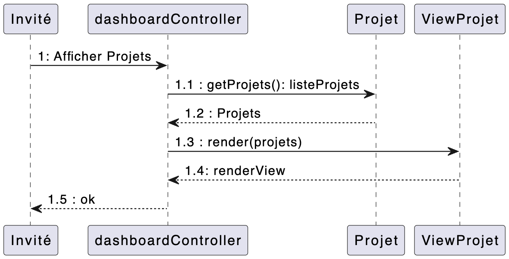

# Cahier des Charges Fonctionnel (CDCF) 

## Présentation du Projet : La O'Vitrine

Le projet consiste à créer une application web de type *"site vitrine"*. Cette application permettra à des clients potentiels (dits "leads") de visualiser le portfolio de l'entreprise proposant ses services, ainsi que d'obtenir des détails sur des projets réalisés.  

## Besoins et Objectifs

Besoin Identifiés : 
- Un invité doit pouvoir consulter la liste des projets réalisés par l'entreprise ; le nom du projet, une courte description, et la technologie sont exposés publiquement. 
- Un invité doit pouvoir consulter les détails d'un projet en particulier.  
- Un invité doit pouvoir consulter les informations de contact de l'entreprise.  
- Un invité doit pouvoir consulter les réseaux sociaux de l'entreprise.  

Objectifs du Projet : 
- Fournir une interface utilisateur simple et intuitive.  
- Permettre aux invités de visualiser l'entièreté du portfolio de l'entreprise. 
- Permettre aux invités d'obtenir des informations spécifiques à un projet exposé sur le site vitrine.  
- Permettre aux invités de contacter l'entreprise via email. 
- Permettre aux invités de contacter l'entreprise via les réseaux sociaux. 

## Fonctionnalités du Projet

**Spécifications Fonctionnelles** :

1. Visualiser la liste des projets du portfolio.

> Un invité peut consulter la liste des projets du portfolio via la page d'accueil.
  
2. Consulter un projet avec une vue détaillée. 
 
> Un invité peut obtenir des informations complémentaires sur un projet en naviguant sur sa page dédiée.
3. Contacter l'entreprise

> - Un invité peut contacter l'entreprise via ses *socials* (X/Twitter, GitHub, LinkedIn)
> - Un invité peut contacter l'entreprise via email

**Évolutions Potentielles** : aucune évolution potentielle recensée à ce jour ; pas même l'ajout d'un back-office.  

## Cible du Projet

Le public cible de ce projet sont les professionnels, agences de recrutements & prestations de services, et plus généralement toute entreprise ayant des ressources financières avec besoin de ressources techniques et humaines afin de mener à bien un projet digital.  

## Arborescence de l'Application 

**Page d'Accueil** :

- Informations de contact de l'entreprise,
- Liste des projets du portfolio avec description succincte. 

**Page de Détails d'un Projet** :

- Détails sur le projet sélectionné.

## Liste des User Stories  

| User Story | En tant que... | Je veux...                                                            | Afin de...                                                    |
| ---------- | -------------- | --------------------------------------------------------------------- | ------------------------------------------------------------- |
| 1          | Invité | pouvoir visualiser la liste des projets réalisés par l'entreprise                    | depuis la page d'accueil.                                     |
| 2          | Invité | pouvoir visualiser un projet en détail                    | depuis la page de détail d'un projet.                                     |
| 3          | Invité | pouvoir contacter l'entreprise via email                    | depuis la page d'accueil.                                     |
| 4          | Invité | pouvoir contacter l'entreprise via les réseaux sociaux                 | depuis la page d'accueil.                                     |
| 5          | Invité | pouvoir contacter l'entreprise via email                    | depuis la page de détail d'un projet.                                     |
| 6          | Invité | pouvoir contacter l'entreprise via les réseaux sociaux                 | depuis la page de détail d'un projet.                                     |

## Use Cases Diagramme (UC)

## Diagramme de Séquence

*FindAllProjects* :

*FindProjectById* :

## Diagramme de Classe

## Entités-Relations Diagramme (ERD)

## Wireframes 

Page d'accueil :

  

Page de projet :

## Maquettes

Page d'accueil :

  

Page de projet :

