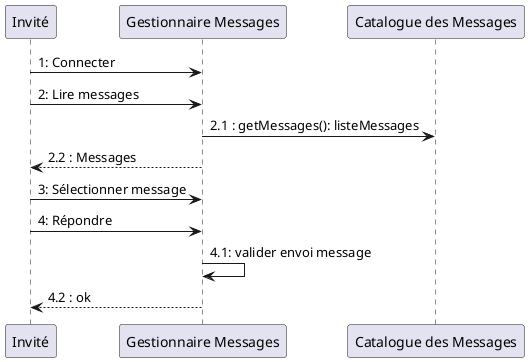

# Episode 02 : Réflexions sur le projet

**Contexte**

Après votre premier jour de brainstorming ~~sur le rooftop~~ sur la conception de l'application, vous vous entretenez à plusieurs reprises avec le client. A la suite de cette série de réunions, un Cahier des Charges Fonctionnel (CDCF) partiel est établi et accepté par le client. [Vous retrouverez le CDCF ici](./CDCF.md).  

Votre mission ~~im~~possible du jour, si vous l'acceptez, consiste à approfondir la réflexion et détecter les points d'améliorations sur votre conception. En particulier, il vous faut : 
1. Lire attentivement [le CDCF](./CDCF.md),
1. Revoir vos diagrammes de cas d'utilisation,
1. Revoir vos maquettes,
1. Concevoir un/des diagrammes de séquence décrivant l'affichage de tous les projets confondus, et l'affichage projet spécifique, 
1. Compléter les sections manquantes du CDCF à l'aide de vos maquettes, diagrammes de cas d'utilisation et diagrammes de séquence (sections sur le diagramme de classe et d'entités-relation non incluses, évidemment).

## Rappel UML : le Diagramme de Séquence

Un diagramme de séquence montre les flots de communications. Il s'agit d'une vue temporelle de l'interaction entre objets. Là où le cas d'utilisation présente une vue externe du système, le diagramme de séquence, lui, montre comment des objets peuvent collaborer pour réaliser les cas d'utilisation. 

Le but **d'un** diagramme de séquence est de préciser le contenu **d'un** cas d'utilisation en décrivant les scénarii possibles (aussi appelés flots d'évènements). En pratique, on ne décrit que les scénarii les plus représentatifs.  

**Rappel :** pour réaliser vos diagrammes UML, on vous recommande d'utiliser [PlantUML](https://plantuml.com/), que vous pouvez [télécharger ici](https://plantuml.com/download). Il existe également une [extension VSCode](https://marketplace.visualstudio.com/items?itemName=jebbs.plantuml). 

Cela vous permettra donc de mettre vos fichiers PlantUML (diagrammes) dans un repo Git !

Enfin, vous retrouverez la section de la [documentation de PlantUML dédiée aux diagrammes de séquence ici.](https://plantuml.com/sequence-diagram).
